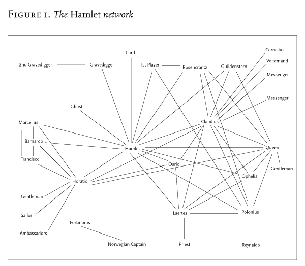
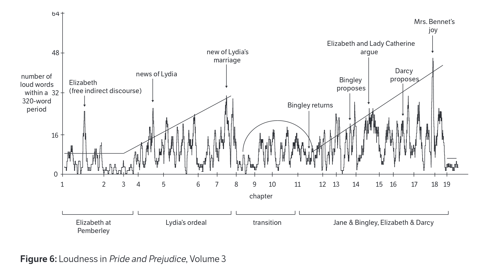
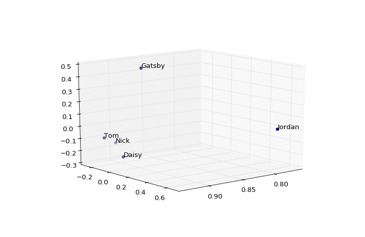
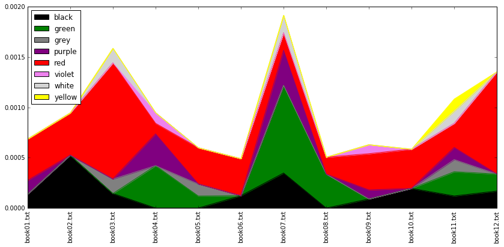
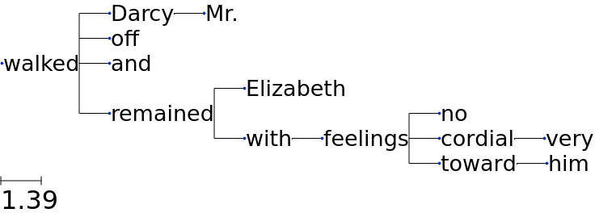

#Computational Text Analysis and Visualization

#Bio

 * Jonathan Reeve, grad student, Department of English and Comparative Literature
 * Specializing in computational literary analysis
 * Member, Group for Experimental Methods in the Humanities
 * Meets every Friday, 3-5pm, Studio@Butler 

#Examples

---

Stanford Literary Lab

---

Matt Daniels

---

Andreas Mueller

---

Stanford Literary Lab 

---

---

Programmatic Generation of Socratic Dialogues

*Socrates*: Do you came down, attain immortality as we must first make the longest ears—No, Phaedrus, then pray to agree and writing speeches.

*Phaedrus*: Certainly. Yes, certainly. What he must speak then I think he speaks is being guided about, which you mean?

*Socrates*: Do you seem less sense about rhetoric.

*Phaedrus*: True. What?

--- 

---

---

---

--- 

#Let’s do it ourselves!

You’ll need these software ingredients: 

 * Python 3
 * NLTK for Python 3
 * Pandas for Python 3
 * Wordcloud for Python 3

--- 

Ways to use that software: 

 * On your computer (recommended)
 * On DHBox.org (temporary)

---

Links: 

 * This workshop's code repository: <http://github.com/JonathanReeve/dataviz-2017> 
 * DHBox: <http://dhbox.org> (U: dataviz-2017 PW: dataviz-2017)
 * The free online NLTK book: <http://nltk.org/book> 
